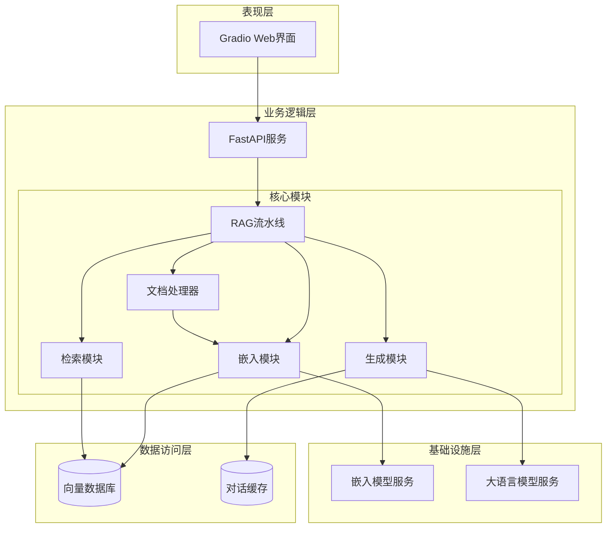
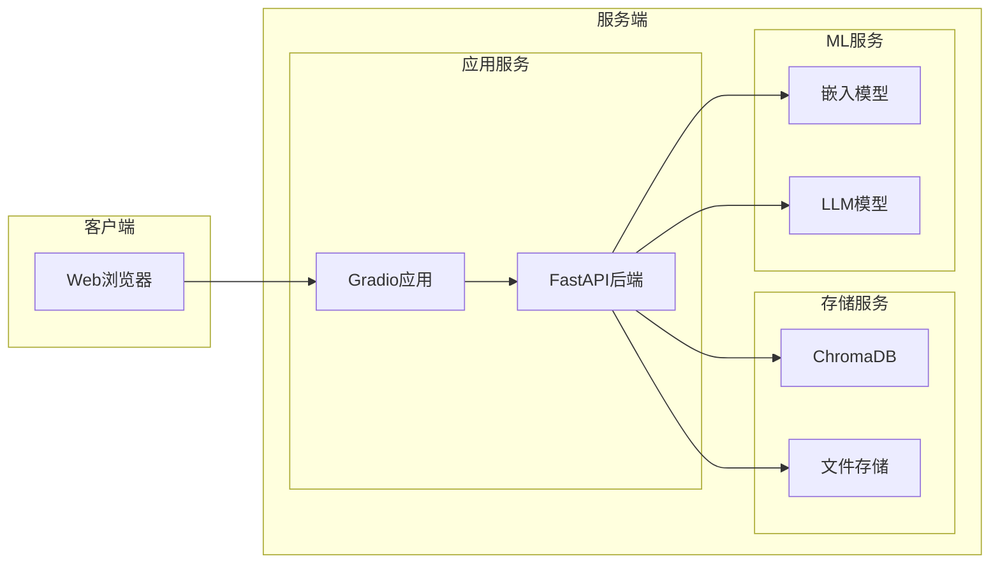
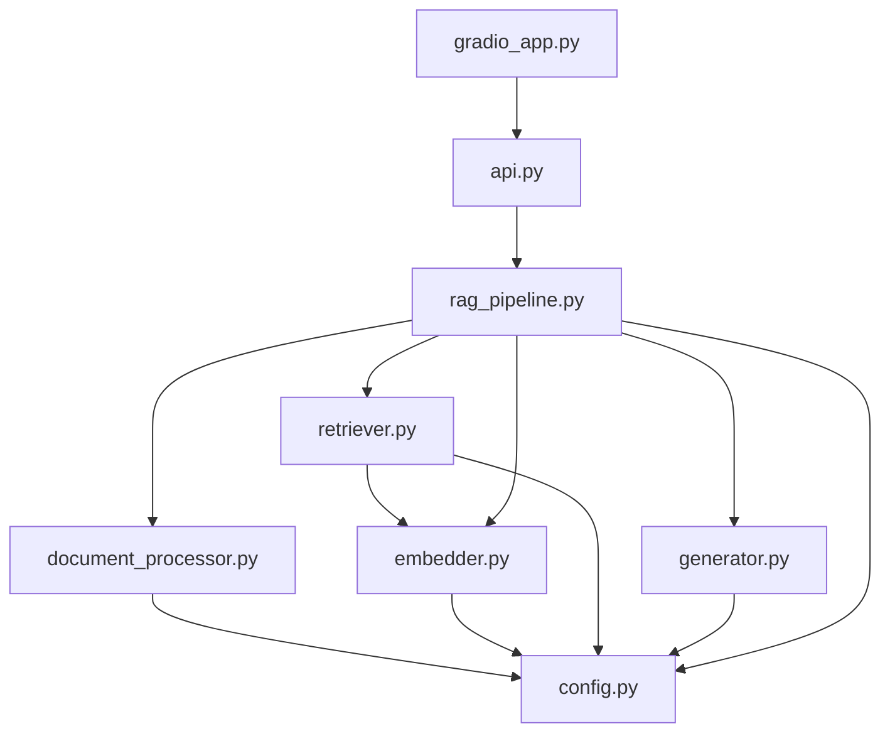
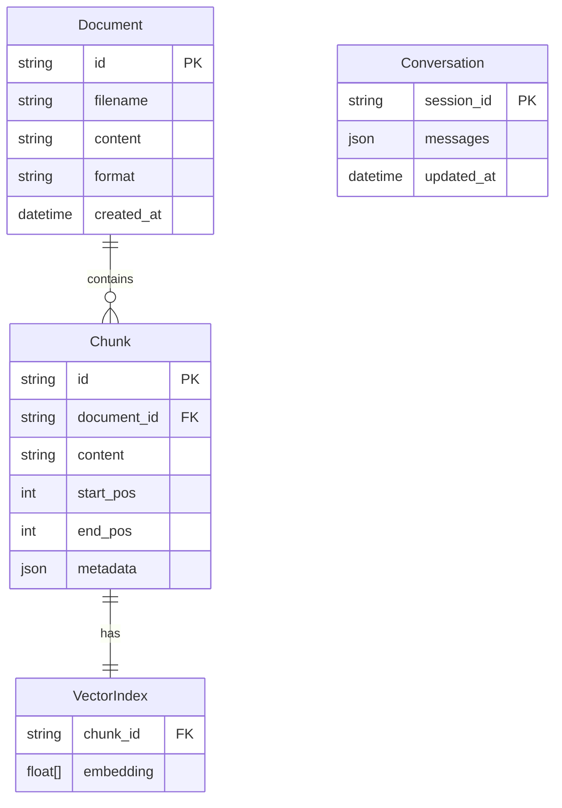
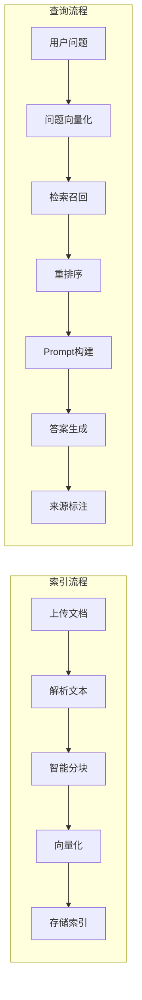
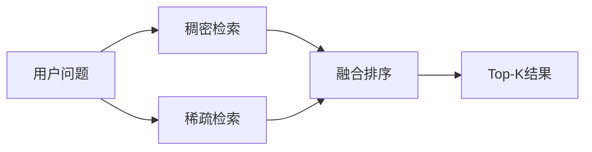

# RAG增强智能问答系统 - 概要设计文档

## 1. 引言

### 1.1 文档目的

本文档描述RAG增强智能问答系统的整体架构设计、模块划分和关键技术方案，为详细设计和编码实现提供指导。

### 1.2 系统范围

本系统是一个基于检索增强生成(RAG)技术的智能问答系统，主要功能包括：
- 多格式文档上传与解析
- 文本智能分块与向量化索引
- 语义检索与混合检索
- 基于大语言模型的答案生成
- 来源引用与答案溯源
- 多轮对话支持

### 1.3 参考资料

- 《需求分析.md》
- LangChain框架文档
- ChromaDB官方文档
- Gradio组件文档

---

## 2. 系统架构设计

### 2.1 总体架构

系统采用分层架构设计，包含表现层、业务逻辑层、数据访问层和基础设施层。



### 2.2 架构说明

| 层次 | 职责 | 技术选型 |
|-----|------|---------|
| 表现层 | 用户交互界面 | Gradio |
| 业务逻辑层 | 核心业务处理 | FastAPI + Python |
| 数据访问层 | 数据存储与检索 | ChromaDB |
| 基础设施层 | AI模型服务 | BGE-M3 + Qwen2.5 |

### 2.3 部署架构



---

## 3. 模块设计

### 3.1 模块划分

| 模块名称 | 文件 | 职责 |
|---------|------|------|
| 配置管理 | config.py | 系统配置参数管理 |
| 文档处理 | document_processor.py | 文档解析与分块 |
| 嵌入模块 | embedder.py | 文本向量化 |
| 检索模块 | retriever.py | 文档检索 |
| 生成模块 | generator.py | 答案生成 |
| RAG流水线 | rag_pipeline.py | 流程编排 |
| API服务 | api.py | HTTP接口 |
| 前端应用 | gradio_app.py | Web界面 |

### 3.2 模块依赖关系



### 3.3 核心模块概要

#### 3.3.1 文档处理模块 (document_processor.py)

**职责**：
- 解析多种格式文档（PDF、TXT、DOCX、Markdown）
- 智能文本分块
- 元数据提取

**主要类**：
- `DocumentProcessor`: 文档处理器
- `SemanticChunker`: 语义分块器（创新点）

**关键算法**：
- 自适应分块算法：基于语义边界进行分块

#### 3.3.2 嵌入模块 (embedder.py)

**职责**：
- 文本向量化
- 向量数据库管理
- 批量处理优化

**主要类**：
- `Embedder`: 嵌入器
- `VectorStore`: 向量存储管理

**技术选型**：
- 嵌入模型：BGE-M3（中英双语）
- 向量数据库：ChromaDB

#### 3.3.3 检索模块 (retriever.py)

**职责**：
- 向量相似度检索
- BM25稀疏检索
- 混合检索策略（创新点）
- 结果重排序（创新点）

**主要类**：
- `DenseRetriever`: 稠密检索器
- `SparseRetriever`: 稀疏检索器
- `HybridRetriever`: 混合检索器
- `Reranker`: 重排序器

#### 3.3.4 生成模块 (generator.py)

**职责**：
- Prompt构建
- 调用LLM生成答案
- 来源引用标注
- 流式输出

**主要类**：
- `Generator`: 生成器
- `PromptBuilder`: Prompt构建器
- `SourceTracer`: 来源追踪器（创新点）

#### 3.3.5 RAG流水线 (rag_pipeline.py)

**职责**：
- 编排完整RAG流程
- 管理对话历史
- 异常处理

**主要类**：
- `RAGPipeline`: RAG流水线
- `ConversationManager`: 对话管理器

---

## 4. 数据设计

### 4.1 数据模型



### 4.2 数据流



---

## 5. 接口设计

### 5.1 API接口概览

| 接口路径 | 方法 | 描述 |
|---------|------|------|
| /api/documents/upload | POST | 上传文档 |
| /api/documents | GET | 获取文档列表 |
| /api/documents/{id} | DELETE | 删除文档 |
| /api/qa/query | POST | 提交问题 |
| /api/qa/stream | POST | 流式问答 |
| /api/conversation/clear | POST | 清空对话 |

### 5.2 接口定义摘要

#### 上传文档

```
POST /api/documents/upload
Content-Type: multipart/form-data

Request:
  - file: 文档文件
  - metadata: JSON (可选)

Response:
{
  "status": "success",
  "document_id": "doc_xxx",
  "chunk_count": 15,
  "message": "文档上传成功"
}
```

#### 提交问题

```
POST /api/qa/query
Content-Type: application/json

Request:
{
  "question": "什么是机器学习？",
  "session_id": "session_xxx",
  "top_k": 5
}

Response:
{
  "answer": "机器学习是...",
  "sources": [
    {
      "chunk_id": "chunk_xxx",
      "content": "原文片段...",
      "document": "文档名.pdf",
      "score": 0.95
    }
  ],
  "confidence": 0.92
}
```

---

## 6. 技术选型

### 6.1 核心技术栈

| 类别 | 技术 | 版本 | 选型理由 |
|-----|------|------|---------|
| 语言 | Python | 3.10+ | ML生态完善 |
| 后端框架 | FastAPI | 0.100+ | 高性能、异步 |
| 前端框架 | Gradio | 4.0+ | 快速构建ML界面 |
| 向量数据库 | ChromaDB | 0.4+ | 轻量级、易用 |
| 文档解析 | LangChain | 0.1+ | 多格式支持 |

### 6.2 AI模型选型

| 用途 | 模型 | 说明 |
|-----|------|------|
| 文本嵌入 | BGE-M3 | 中英双语，1024维 |
| 答案生成 | Qwen2.5-7B | 开源，中文能力强 |
| 重排序 | bge-reranker-base | Cross-Encoder重排序 |

---

## 7. 创新设计

### 7.1 混合检索策略

结合稀疏检索(BM25)和稠密检索(向量)的优势：



**算法**：
```
final_score = α × dense_score + (1-α) × sparse_score
其中 α 为可调权重参数，默认 0.7
```

### 7.2 自适应分块

基于语义边界的智能分块，避免在句子中间切分：

1. 使用句子分割器切分文本
2. 计算相邻句子的语义相似度
3. 在相似度较低的位置作为分块边界
4. 控制块大小在目标范围内

### 7.3 答案溯源

在答案中标注来源，并高亮显示对应原文：

1. 生成答案时提取关键片段
2. 与检索结果进行匹配
3. 添加引用标记
4. 前端展示高亮效果

### 7.4 检索结果重排序

使用Cross-Encoder对初步检索结果进行重排序：

1. 初步检索获取Top-K×2结果
2. 使用重排序模型评分
3. 返回重排序后的Top-K结果

---

## 8. 异常处理

### 8.1 异常分类

| 异常类型 | 处理策略 |
|---------|---------|
| 文件解析失败 | 返回友好错误提示，记录日志 |
| 模型加载失败 | 降级使用备选模型 |
| 检索无结果 | 提示用户无相关内容 |
| LLM调用超时 | 重试机制，最多3次 |
| 并发超限 | 请求队列，排队处理 |

### 8.2 日志设计

| 日志级别 | 内容 |
|---------|------|
| INFO | 正常业务流程 |
| WARNING | 降级处理、重试 |
| ERROR | 异常情况 |
| DEBUG | 调试信息 |

---

## 9. 性能优化

### 9.1 优化策略

| 优化点 | 策略 |
|-------|------|
| 向量检索 | 使用HNSW索引加速 |
| 模型推理 | 批量处理，减少调用次数 |
| 响应速度 | 流式输出 |
| 内存使用 | 惰性加载模型 |
| 并发处理 | 异步IO |

### 9.2 缓存设计

| 缓存类型 | 缓存内容 | 策略 |
|---------|---------|------|
| 模型缓存 | 加载的模型实例 | 单例模式 |
| 嵌入缓存 | 问题向量 | LRU缓存 |
| 会话缓存 | 对话历史 | TTL过期 |

---

## 10. 安全设计

### 10.1 输入验证

- 文件类型白名单
- 文件大小限制
- 文本内容过滤

### 10.2 访问控制

- 会话隔离
- 请求频率限制

---

## 附录：技术规格

### A. 向量维度

- BGE-M3: 1024维
- 相似度度量: 余弦相似度

### B. 分块参数

- 默认块大小: 512 tokens
- 重叠大小: 64 tokens
- 最大块大小: 1024 tokens
