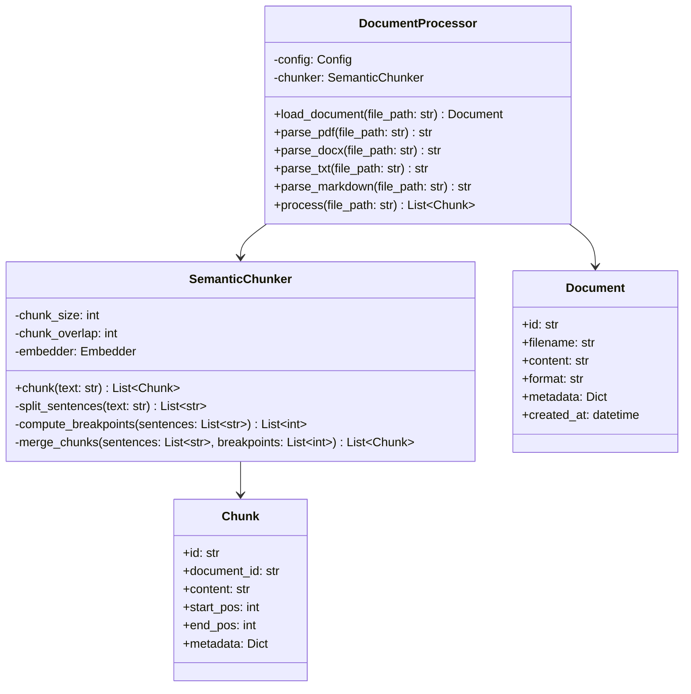
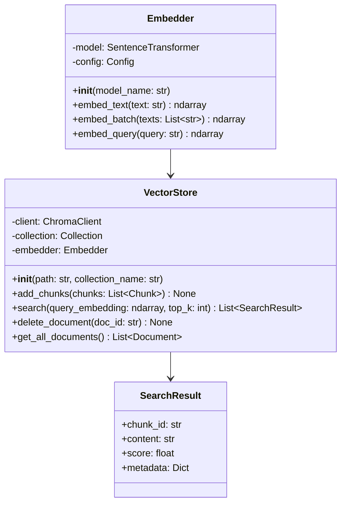
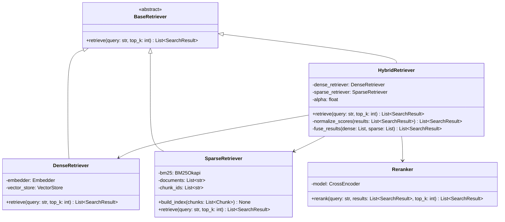
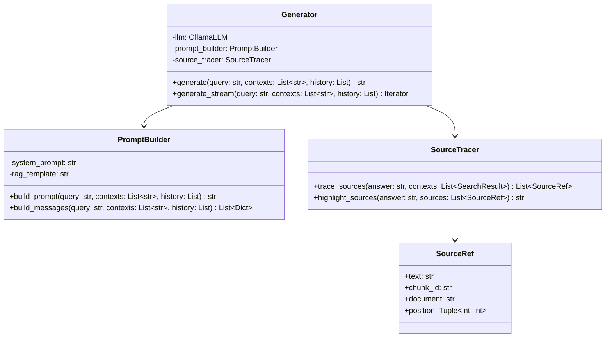
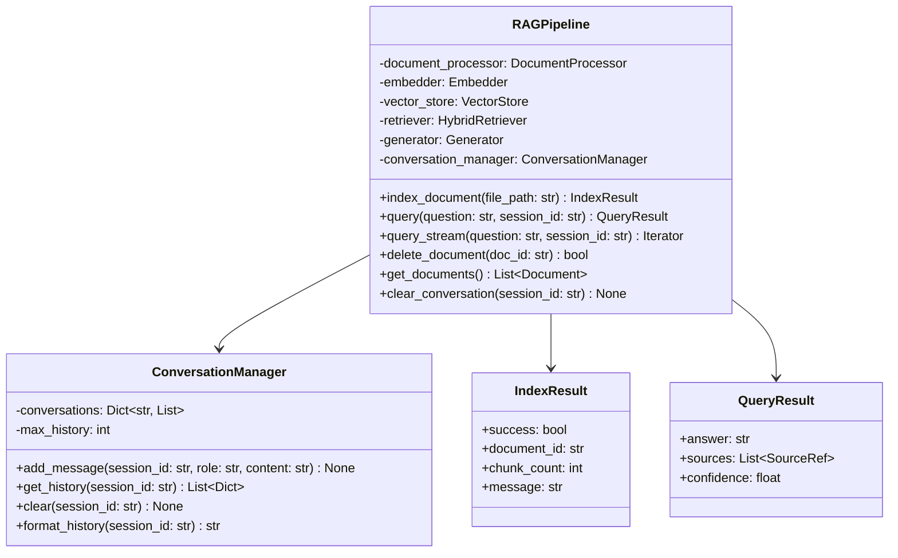
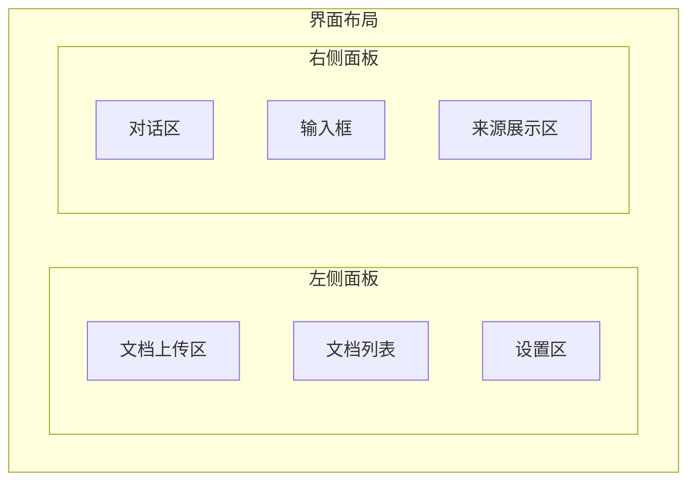

# RAG增强智能问答系统 - 详细设计文档

## 1. 引言

### 1.1 文档目的

本文档详细描述RAG增强智能问答系统各模块的内部设计，包括类设计、接口定义、算法详解和数据结构，为编码实现提供直接指导。

### 1.2 参考文档

- 《需求分析.md》
- 《概要设计.md》

---

## 2. 模块详细设计

### 2.1 配置管理模块 (config.py)

#### 2.1.1 类设计

```python
class Config:
    """系统配置管理类"""
    
    # 文档处理配置
    CHUNK_SIZE: int = 512          # 分块大小(tokens)
    CHUNK_OVERLAP: int = 64        # 分块重叠
    MAX_FILE_SIZE: int = 50 * 1024 * 1024  # 最大文件大小(50MB)
    SUPPORTED_FORMATS: List[str] = [".pdf", ".txt", ".docx", ".md"]
    
    # 嵌入模型配置
    EMBEDDING_MODEL: str = "BAAI/bge-m3"
    EMBEDDING_DIM: int = 1024
    EMBEDDING_BATCH_SIZE: int = 32
    
    # 向量数据库配置
    VECTOR_DB_PATH: str = "./data/chroma_db"
    COLLECTION_NAME: str = "documents"
    
    # 检索配置
    TOP_K: int = 5
    RERANK_TOP_K: int = 10
    HYBRID_ALPHA: float = 0.7      # 混合检索权重
    
    # 生成配置
    LLM_MODEL: str = "qwen2.5:7b"
    MAX_NEW_TOKENS: int = 1024
    TEMPERATURE: float = 0.7
    
    # 服务配置
    HOST: str = "0.0.0.0"
    PORT: int = 7860
```

---

### 2.2 文档处理模块 (document_processor.py)

#### 2.2.1 类图



#### 2.2.2 核心方法详解

##### load_document()

```python
def load_document(self, file_path: str) -> Document:
    """
    加载并解析文档
    
    Args:
        file_path: 文档路径
        
    Returns:
        Document: 解析后的文档对象
        
    Raises:
        ValueError: 不支持的文件格式
        FileNotFoundError: 文件不存在
    """
```

**处理流程**：
1. 验证文件存在性和格式
2. 根据扩展名选择解析器
3. 提取文本内容和元数据
4. 构建Document对象返回

##### SemanticChunker.chunk() - 创新算法

```python
def chunk(self, text: str, doc_id: str) -> List[Chunk]:
    """
    基于语义边界的智能分块
    
    算法步骤：
    1. 使用句子分割器切分文本
    2. 计算相邻句子的嵌入向量
    3. 计算相邻句子间的余弦相似度
    4. 找出相似度低于阈值的位置作为潜在分割点
    5. 根据目标块大小合并句子，优先在潜在分割点切分
    """
```

**算法伪代码**：
```
function semantic_chunk(text, target_size, overlap):
    sentences = split_into_sentences(text)
    embeddings = embed_sentences(sentences)
    
    # 计算相邻句子相似度
    similarities = []
    for i in range(len(sentences) - 1):
        sim = cosine_similarity(embeddings[i], embeddings[i+1])
        similarities.append(sim)
    
    # 找出语义断点（相似度低的位置）
    threshold = percentile(similarities, 25)
    breakpoints = [i for i, s in enumerate(similarities) if s < threshold]
    
    # 合并成块
    chunks = []
    current_chunk = []
    current_size = 0
    
    for i, sentence in enumerate(sentences):
        if current_size + len(sentence) > target_size and i in breakpoints:
            chunks.append(join(current_chunk))
            # 保留overlap
            current_chunk = current_chunk[-overlap:]
            current_size = sum(len(s) for s in current_chunk)
        current_chunk.append(sentence)
        current_size += len(sentence)
    
    if current_chunk:
        chunks.append(join(current_chunk))
    
    return chunks
```

---

### 2.3 嵌入模块 (embedder.py)

#### 2.3.1 类图



#### 2.3.2 核心方法详解

##### embed_batch()

```python
def embed_batch(self, texts: List[str]) -> np.ndarray:
    """
    批量文本嵌入
    
    Args:
        texts: 文本列表
        
    Returns:
        embeddings: 形状为 (n, dim) 的嵌入矩阵
        
    实现细节：
    - 使用模型的encode方法
    - 自动批处理优化内存
    - 归一化向量便于余弦相似度计算
    """
    embeddings = self.model.encode(
        texts,
        batch_size=self.config.EMBEDDING_BATCH_SIZE,
        normalize_embeddings=True,
        show_progress_bar=True
    )
    return embeddings
```

##### VectorStore.add_chunks()

```python
def add_chunks(self, chunks: List[Chunk]) -> None:
    """
    添加文本块到向量数据库
    
    Args:
        chunks: 文本块列表
        
    实现流程：
    1. 提取文本内容列表
    2. 批量计算嵌入向量
    3. 构建元数据
    4. 调用ChromaDB的add方法
    """
    texts = [chunk.content for chunk in chunks]
    embeddings = self.embedder.embed_batch(texts)
    
    ids = [chunk.id for chunk in chunks]
    metadatas = [
        {
            "document_id": chunk.document_id,
            "start_pos": chunk.start_pos,
            "end_pos": chunk.end_pos,
            **chunk.metadata
        }
        for chunk in chunks
    ]
    
    self.collection.add(
        ids=ids,
        embeddings=embeddings.tolist(),
        documents=texts,
        metadatas=metadatas
    )
```

---

### 2.4 检索模块 (retriever.py)

#### 2.4.1 类图



#### 2.4.2 混合检索算法 - 创新点

```python
def retrieve(self, query: str, top_k: int = 5) -> List[SearchResult]:
    """
    混合检索：结合稠密检索和稀疏检索
    
    算法：
    1. 稠密检索获取 top_k * 2 结果
    2. 稀疏检索获取 top_k * 2 结果
    3. 分数归一化
    4. 加权融合
    5. 重排序获取最终 top_k
    """
    # 稠密检索
    dense_results = self.dense_retriever.retrieve(query, top_k * 2)
    
    # 稀疏检索
    sparse_results = self.sparse_retriever.retrieve(query, top_k * 2)
    
    # 归一化分数到 [0, 1]
    dense_results = self.normalize_scores(dense_results)
    sparse_results = self.normalize_scores(sparse_results)
    
    # 加权融合
    fused_results = self.fuse_results(dense_results, sparse_results)
    
    # 重排序
    if self.reranker:
        fused_results = self.reranker.rerank(query, fused_results, top_k)
    
    return fused_results[:top_k]


def fuse_results(
    self, 
    dense: List[SearchResult], 
    sparse: List[SearchResult]
) -> List[SearchResult]:
    """
    融合稠密和稀疏检索结果
    
    公式: final_score = α × dense_score + (1-α) × sparse_score
    """
    score_map = {}
    result_map = {}
    
    # 收集稠密检索分数
    for r in dense:
        score_map[r.chunk_id] = {"dense": r.score, "sparse": 0}
        result_map[r.chunk_id] = r
    
    # 收集稀疏检索分数
    for r in sparse:
        if r.chunk_id in score_map:
            score_map[r.chunk_id]["sparse"] = r.score
        else:
            score_map[r.chunk_id] = {"dense": 0, "sparse": r.score}
            result_map[r.chunk_id] = r
    
    # 计算融合分数
    fused = []
    for chunk_id, scores in score_map.items():
        final_score = (
            self.alpha * scores["dense"] + 
            (1 - self.alpha) * scores["sparse"]
        )
        result = result_map[chunk_id]
        result.score = final_score
        fused.append(result)
    
    # 按分数降序排序
    fused.sort(key=lambda x: x.score, reverse=True)
    return fused
```

#### 2.4.3 重排序算法 - 创新点

```python
class Reranker:
    """使用Cross-Encoder进行重排序"""
    
    def __init__(self, model_name: str = "BAAI/bge-reranker-base"):
        self.model = CrossEncoder(model_name)
    
    def rerank(
        self, 
        query: str, 
        results: List[SearchResult], 
        top_k: int
    ) -> List[SearchResult]:
        """
        对检索结果重排序
        
        原理：
        Cross-Encoder同时接收query和document作为输入，
        能够建模更精细的交互关系，排序效果优于Bi-Encoder
        """
        if not results:
            return results
        
        # 构建输入对
        pairs = [(query, r.content) for r in results]
        
        # 获取重排序分数
        scores = self.model.predict(pairs)
        
        # 更新分数并排序
        for i, result in enumerate(results):
            result.rerank_score = float(scores[i])
        
        results.sort(key=lambda x: x.rerank_score, reverse=True)
        return results[:top_k]
```

---

### 2.5 生成模块 (generator.py)

#### 2.5.1 类图



#### 2.5.2 Prompt模板设计

```python
SYSTEM_PROMPT = """你是一个专业的问答助手。请根据提供的参考资料回答用户问题。

规则：
1. 只根据参考资料回答，不要编造信息
2. 如果参考资料中没有相关内容，请明确说明"根据现有资料无法回答"
3. 回答时引用来源，使用[1], [2]等标记
4. 回答要准确、简洁、有条理
5. 使用与用户问题相同的语言回答
"""

RAG_TEMPLATE = """参考资料：
{contexts}

对话历史：
{history}

用户问题：{query}

请根据参考资料回答上述问题："""
```

#### 2.5.3 来源追踪算法 - 创新点

```python
class SourceTracer:
    """答案来源追踪器"""
    
    def trace_sources(
        self, 
        answer: str, 
        contexts: List[SearchResult]
    ) -> List[SourceRef]:
        """
        追踪答案中的内容来源
        
        算法：
        1. 提取答案中的关键句子
        2. 与每个context计算相似度
        3. 相似度超过阈值则标记为来源
        """
        sources = []
        answer_sentences = self._split_sentences(answer)
        
        for sent in answer_sentences:
            best_match = None
            best_score = 0
            
            for ctx in contexts:
                # 计算句子与context的相似度
                score = self._compute_similarity(sent, ctx.content)
                if score > best_score and score > 0.6:
                    best_score = score
                    best_match = ctx
            
            if best_match:
                sources.append(SourceRef(
                    text=sent,
                    chunk_id=best_match.chunk_id,
                    document=best_match.metadata.get("filename", "unknown"),
                    score=best_score
                ))
        
        return self._deduplicate(sources)
    
    def highlight_sources(
        self, 
        answer: str, 
        sources: List[SourceRef]
    ) -> str:
        """
        在答案中添加来源标记
        
        输出格式：
        "机器学习是一种人工智能方法[1]..."
        """
        # 按出现位置排序来源
        source_map = {}
        for i, source in enumerate(sources, 1):
            if source.chunk_id not in source_map:
                source_map[source.chunk_id] = i
        
        # 添加引用标记
        highlighted = answer
        for source in sources:
            ref_num = source_map[source.chunk_id]
            # 在对应句子后添加引用
            highlighted = highlighted.replace(
                source.text,
                f"{source.text}[{ref_num}]"
            )
        
        return highlighted
```

---

### 2.6 RAG流水线 (rag_pipeline.py)

#### 2.6.1 类图



#### 2.6.2 核心流程

##### 文档索引流程

```python
def index_document(self, file_path: str) -> IndexResult:
    """
    索引文档
    
    流程：
    1. 验证文件
    2. 加载并解析文档
    3. 智能分块
    4. 向量化并存储
    5. 更新稀疏索引
    """
    try:
        # 1. 加载文档
        document = self.document_processor.load_document(file_path)
        
        # 2. 智能分块
        chunks = self.document_processor.process(document)
        
        # 3. 向量化存储
        self.vector_store.add_chunks(chunks)
        
        # 4. 更新BM25索引
        self.retriever.sparse_retriever.add_chunks(chunks)
        
        return IndexResult(
            success=True,
            document_id=document.id,
            chunk_count=len(chunks),
            message=f"成功索引文档，共{len(chunks)}个文本块"
        )
    except Exception as e:
        return IndexResult(
            success=False,
            document_id=None,
            chunk_count=0,
            message=f"索引失败: {str(e)}"
        )
```

##### 问答流程

```python
def query(self, question: str, session_id: str = "default") -> QueryResult:
    """
    处理用户问题
    
    流程：
    1. 获取对话历史
    2. 问题改写（可选，结合历史理解指代）
    3. 混合检索
    4. 重排序
    5. 生成答案
    6. 来源追踪
    7. 更新对话历史
    """
    # 1. 获取对话历史
    history = self.conversation_manager.get_history(session_id)
    
    # 2. 检索相关内容
    search_results = self.retriever.retrieve(
        question, 
        top_k=self.config.TOP_K
    )
    
    if not search_results:
        return QueryResult(
            answer="抱歉，根据现有知识库无法找到相关内容。",
            sources=[],
            confidence=0.0
        )
    
    # 3. 构建上下文
    contexts = [r.content for r in search_results]
    
    # 4. 生成答案
    answer = self.generator.generate(
        query=question,
        contexts=contexts,
        history=history
    )
    
    # 5. 来源追踪
    sources = self.generator.source_tracer.trace_sources(
        answer, 
        search_results
    )
    
    # 6. 添加引用标记
    answer_with_refs = self.generator.source_tracer.highlight_sources(
        answer, 
        sources
    )
    
    # 7. 更新对话历史
    self.conversation_manager.add_message(session_id, "user", question)
    self.conversation_manager.add_message(session_id, "assistant", answer)
    
    # 8. 计算置信度
    confidence = sum(r.score for r in search_results[:3]) / 3
    
    return QueryResult(
        answer=answer_with_refs,
        sources=sources,
        confidence=confidence
    )
```

---

### 2.7 API服务 (api.py)

#### 2.7.1 接口详细定义

```python
from fastapi import FastAPI, UploadFile, File, HTTPException
from pydantic import BaseModel
from typing import List, Optional

app = FastAPI(title="RAG问答系统API")

# ========== 数据模型 ==========

class QueryRequest(BaseModel):
    question: str
    session_id: Optional[str] = "default"
    top_k: Optional[int] = 5

class QueryResponse(BaseModel):
    answer: str
    sources: List[dict]
    confidence: float

class DocumentInfo(BaseModel):
    id: str
    filename: str
    chunk_count: int
    created_at: str

class UploadResponse(BaseModel):
    status: str
    document_id: str
    chunk_count: int
    message: str

# ========== API端点 ==========

@app.post("/api/documents/upload", response_model=UploadResponse)
async def upload_document(file: UploadFile = File(...)):
    """
    上传并索引文档
    
    - 支持格式: PDF, TXT, DOCX, Markdown
    - 最大文件大小: 50MB
    """
    # 验证文件格式
    if not any(file.filename.endswith(ext) for ext in SUPPORTED_FORMATS):
        raise HTTPException(400, "不支持的文件格式")
    
    # 保存文件
    file_path = save_upload_file(file)
    
    # 索引文档
    result = rag_pipeline.index_document(file_path)
    
    if not result.success:
        raise HTTPException(500, result.message)
    
    return UploadResponse(
        status="success",
        document_id=result.document_id,
        chunk_count=result.chunk_count,
        message=result.message
    )

@app.get("/api/documents", response_model=List[DocumentInfo])
async def list_documents():
    """获取已索引的文档列表"""
    documents = rag_pipeline.get_documents()
    return [
        DocumentInfo(
            id=doc.id,
            filename=doc.filename,
            chunk_count=doc.chunk_count,
            created_at=doc.created_at.isoformat()
        )
        for doc in documents
    ]

@app.delete("/api/documents/{doc_id}")
async def delete_document(doc_id: str):
    """删除指定文档"""
    success = rag_pipeline.delete_document(doc_id)
    if not success:
        raise HTTPException(404, "文档不存在")
    return {"status": "success", "message": "文档已删除"}

@app.post("/api/qa/query", response_model=QueryResponse)
async def query(request: QueryRequest):
    """
    提交问题并获取答案
    
    - 支持多轮对话（通过session_id关联）
    - 返回答案及来源引用
    """
    result = rag_pipeline.query(
        question=request.question,
        session_id=request.session_id
    )
    
    return QueryResponse(
        answer=result.answer,
        sources=[
            {
                "chunk_id": s.chunk_id,
                "document": s.document,
                "text": s.text,
                "score": s.score
            }
            for s in result.sources
        ],
        confidence=result.confidence
    )

@app.post("/api/conversation/clear")
async def clear_conversation(session_id: str = "default"):
    """清空对话历史"""
    rag_pipeline.clear_conversation(session_id)
    return {"status": "success", "message": "对话历史已清空"}
```

---

### 2.8 前端应用 (gradio_app.py)

#### 2.8.1 界面设计



#### 2.8.2 组件设计

```python
import gradio as gr

def create_app():
    with gr.Blocks(title="RAG智能问答系统", theme=gr.themes.Soft()) as app:
        gr.Markdown("# 🤖 RAG增强智能问答系统")
        gr.Markdown("上传文档，然后基于文档内容进行问答")
        
        with gr.Row():
            # 左侧面板
            with gr.Column(scale=1):
                gr.Markdown("### 📁 文档管理")
                
                file_upload = gr.File(
                    label="上传文档",
                    file_types=[".pdf", ".txt", ".docx", ".md"],
                    file_count="multiple"
                )
                upload_btn = gr.Button("📤 上传并索引", variant="primary")
                upload_status = gr.Textbox(label="上传状态", interactive=False)
                
                gr.Markdown("### 📋 已索引文档")
                doc_list = gr.Dataframe(
                    headers=["文档名", "块数", "操作"],
                    label="文档列表"
                )
                refresh_btn = gr.Button("🔄 刷新列表")
                
                gr.Markdown("### ⚙️ 设置")
                top_k_slider = gr.Slider(1, 10, value=5, step=1, label="检索数量")
                clear_btn = gr.Button("🗑️ 清空对话")
            
            # 右侧面板
            with gr.Column(scale=2):
                gr.Markdown("### 💬 问答对话")
                
                chatbot = gr.Chatbot(
                    label="对话历史",
                    height=400,
                    show_label=False
                )
                
                with gr.Row():
                    question_input = gr.Textbox(
                        label="输入问题",
                        placeholder="请输入您的问题...",
                        scale=4
                    )
                    send_btn = gr.Button("发送", variant="primary", scale=1)
                
                gr.Markdown("### 📚 来源引用")
                sources_display = gr.JSON(label="答案来源")
        
        # 事件绑定
        upload_btn.click(
            fn=handle_upload,
            inputs=[file_upload],
            outputs=[upload_status, doc_list]
        )
        
        send_btn.click(
            fn=handle_query,
            inputs=[question_input, chatbot, top_k_slider],
            outputs=[chatbot, sources_display, question_input]
        )
        
        question_input.submit(
            fn=handle_query,
            inputs=[question_input, chatbot, top_k_slider],
            outputs=[chatbot, sources_display, question_input]
        )
        
        clear_btn.click(
            fn=handle_clear,
            inputs=[],
            outputs=[chatbot, sources_display]
        )
        
        refresh_btn.click(
            fn=handle_refresh,
            inputs=[],
            outputs=[doc_list]
        )
    
    return app
```

---

## 3. 数据结构详细设计

### 3.1 核心数据类

```python
from dataclasses import dataclass, field
from typing import Dict, List, Optional, Tuple
from datetime import datetime
import uuid

@dataclass
class Document:
    """文档数据类"""
    id: str = field(default_factory=lambda: str(uuid.uuid4()))
    filename: str = ""
    content: str = ""
    format: str = ""
    metadata: Dict = field(default_factory=dict)
    created_at: datetime = field(default_factory=datetime.now)
    chunk_count: int = 0

@dataclass
class Chunk:
    """文本块数据类"""
    id: str = field(default_factory=lambda: str(uuid.uuid4()))
    document_id: str = ""
    content: str = ""
    start_pos: int = 0
    end_pos: int = 0
    metadata: Dict = field(default_factory=dict)

@dataclass
class SearchResult:
    """检索结果数据类"""
    chunk_id: str
    content: str
    score: float
    metadata: Dict
    rerank_score: Optional[float] = None

@dataclass
class SourceRef:
    """来源引用数据类"""
    text: str
    chunk_id: str
    document: str
    score: float
    position: Optional[Tuple[int, int]] = None

@dataclass
class QueryResult:
    """查询结果数据类"""
    answer: str
    sources: List[SourceRef]
    confidence: float
    
@dataclass
class IndexResult:
    """索引结果数据类"""
    success: bool
    document_id: Optional[str]
    chunk_count: int
    message: str
```

---

## 4. 错误处理设计

### 4.1 自定义异常

```python
class RAGException(Exception):
    """RAG系统基础异常"""
    pass

class DocumentParseError(RAGException):
    """文档解析错误"""
    pass

class EmbeddingError(RAGException):
    """嵌入计算错误"""
    pass

class RetrievalError(RAGException):
    """检索错误"""
    pass

class GenerationError(RAGException):
    """生成错误"""
    pass

class ConfigError(RAGException):
    """配置错误"""
    pass
```

### 4.2 错误处理策略

```python
def safe_execute(func, *args, fallback=None, **kwargs):
    """安全执行函数，捕获异常并返回fallback"""
    try:
        return func(*args, **kwargs)
    except RAGException as e:
        logger.error(f"RAG错误: {e}")
        return fallback
    except Exception as e:
        logger.exception(f"未知错误: {e}")
        return fallback
```

---

## 5. 日志设计

```python
import logging

def setup_logging():
    """配置日志系统"""
    logging.basicConfig(
        level=logging.INFO,
        format='%(asctime)s - %(name)s - %(levelname)s - %(message)s',
        handlers=[
            logging.FileHandler('rag_system.log'),
            logging.StreamHandler()
        ]
    )
    
    # 设置各模块日志级别
    logging.getLogger('document_processor').setLevel(logging.INFO)
    logging.getLogger('retriever').setLevel(logging.INFO)
    logging.getLogger('generator').setLevel(logging.INFO)
```

---

## 附录A: 配置文件示例

```yaml
# config.yaml
document:
  chunk_size: 512
  chunk_overlap: 64
  max_file_size: 52428800  # 50MB
  supported_formats:
    - .pdf
    - .txt
    - .docx
    - .md

embedding:
  model: "BAAI/bge-m3"
  dimension: 1024
  batch_size: 32

retrieval:
  top_k: 5
  rerank_top_k: 10
  hybrid_alpha: 0.7

generation:
  model: "qwen2.5:7b"
  max_tokens: 1024
  temperature: 0.7

server:
  host: "0.0.0.0"
  port: 7860
```

## 附录B: 依赖列表

```
# requirements.txt
langchain>=0.1.0
langchain-community>=0.0.10
chromadb>=0.4.0
sentence-transformers>=2.2.0
transformers>=4.35.0
torch>=2.0.0
gradio>=4.0.0
fastapi>=0.100.0
uvicorn>=0.23.0
python-multipart>=0.0.6
pypdf>=3.0.0
python-docx>=0.8.11
markdown>=3.4.0
rank-bm25>=0.2.2
numpy>=1.24.0
pydantic>=2.0.0
ollama>=0.1.0
```
