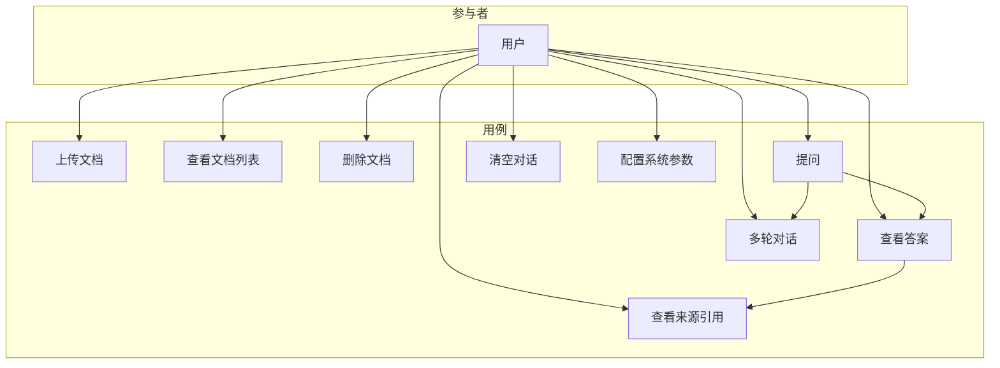

# RAG增强智能问答系统 - 需求分析文档

## 1. 项目背景与目标

### 1.1 项目背景

随着大语言模型(LLM)技术的快速发展，基于检索增强生成(RAG, Retrieval-Augmented Generation)的问答系统成为自然语言处理领域的研究热点。传统的问答系统存在知识更新困难、幻觉问题严重等局限，而RAG技术通过结合外部知识库检索与大模型生成能力，能够有效解决这些问题。

### 1.2 项目目标

本项目旨在构建一个基于RAG技术的中英双语智能问答系统，具备以下核心能力：

1. **文档理解**：支持多种格式文档的上传、解析和索引
2. **智能检索**：基于语义理解的高精度文档片段检索
3. **答案生成**：结合检索内容生成准确、可溯源的答案
4. **双语支持**：同时支持中文和英文文档及问答
5. **创新特性**：混合检索、智能分块、答案溯源等创新功能

---

## 2. 功能需求

### 2.1 功能需求概览

| 需求编号 | 功能名称 | 优先级 | 描述 |
|---------|---------|-------|------|
| F1 | 文档上传与解析 | 高 | 支持PDF、TXT、DOCX、Markdown格式文档的上传和解析 |
| F2 | 文本分块与索引 | 高 | 将文档智能分块并建立向量索引 |
| F3 | 语义检索 | 高 | 基于用户问题检索相关文档片段 |
| F4 | 答案生成 | 高 | 基于检索内容生成准确答案 |
| F5 | 来源引用 | 中 | 显示答案来源的原文片段及位置 |
| F6 | 中英双语支持 | 高 | 支持中英文文档处理和问答 |
| F7 | 对话历史管理 | 中 | 支持多轮对话上下文理解 |
| F8 | Web交互界面 | 高 | 提供友好的用户交互界面 |

### 2.2 功能需求详细描述

#### F1: 文档上传与解析

**功能描述**：
用户可以通过Web界面上传文档，系统自动识别文档格式并进行解析，提取文本内容。

**输入**：
- 文档文件（支持格式：PDF、TXT、DOCX、Markdown）
- 文档元数据（可选：标题、作者、描述）

**输出**：
- 解析后的纯文本内容
- 文档结构信息（标题、段落、页码等）
- 上传状态反馈

**验收标准**：
1. 支持单文件和批量上传
2. 文件大小限制：单文件不超过50MB
3. 解析准确率 > 95%（以人工抽检为准）
4. 解析失败时给出明确错误提示

#### F2: 文本分块与索引

**功能描述**：
将解析后的文档文本按照语义边界进行智能分块，并为每个文本块生成向量嵌入，存储到向量数据库中。

**输入**：
- 解析后的文档文本
- 分块参数（块大小、重叠大小）

**输出**：
- 文本块列表（含元数据）
- 向量索引

**验收标准**：
1. 分块大小可配置（默认512 tokens，重叠64 tokens）
2. 保持语义完整性（不在句子中间切分）
3. 索引建立时间 < 1秒/1000字符
4. 支持增量索引（新增文档不影响已有索引）

#### F3: 语义检索

**功能描述**：
根据用户输入的问题，从向量数据库中检索最相关的文档片段。

**输入**：
- 用户问题
- 检索参数（返回数量、相似度阈值）

**输出**：
- 相关文档片段列表
- 相似度分数
- 来源信息

**验收标准**：
1. 检索响应时间 < 500ms
2. 支持Top-K检索（K可配置，默认5）
3. 检索准确率 > 80%
4. 支持混合检索（向量检索 + BM25）

#### F4: 答案生成

**功能描述**：
基于检索到的文档片段，利用大语言模型生成准确、流畅的答案。

**输入**：
- 用户问题
- 检索到的文档片段
- 对话历史（可选）

**输出**：
- 生成的答案文本
- 置信度评分
- 引用的来源片段

**验收标准**：
1. 答案生成时间 < 5秒
2. 答案基于检索内容，避免幻觉
3. 当知识库无相关内容时，明确告知用户
4. 支持流式输出

#### F5: 来源引用

**功能描述**：
在答案中标注来源，并支持查看原文片段。

**输入**：
- 生成的答案
- 相关文档片段

**输出**：
- 带引用标注的答案
- 可点击查看的来源链接

**验收标准**：
1. 引用准确对应原文
2. 支持高亮显示引用片段
3. 显示来源文档名称和位置

#### F6: 中英双语支持

**功能描述**：
系统支持中文和英文文档的处理，以及中英文问答。

**输入**：
- 中文或英文文档
- 中文或英文问题

**输出**：
- 与问题语言一致的答案

**验收标准**：
1. 中英文文档均能正确解析和索引
2. 跨语言检索准确率 > 70%
3. 答案语言与问题语言一致

#### F7: 对话历史管理

**功能描述**：
保存用户的对话历史，支持基于上下文的多轮问答。

**输入**：
- 当前问题
- 历史对话记录

**输出**：
- 考虑上下文的答案
- 更新后的对话历史

**验收标准**：
1. 保存最近10轮对话
2. 支持上下文指代理解
3. 支持清空对话历史

#### F8: Web交互界面

**功能描述**：
提供直观、易用的Web界面供用户使用系统。

**界面组成**：
1. 文档管理区：上传、查看、删除文档
2. 问答交互区：输入问题、查看答案
3. 对话历史区：显示历史问答记录
4. 设置区：配置系统参数

**验收标准**：
1. 界面响应时间 < 200ms
2. 支持现代浏览器（Chrome、Firefox、Safari、Edge）
3. 操作反馈及时明确
4. 支持移动端适配

---

## 3. 非功能需求

### 3.1 性能需求

| 需求编号 | 需求项 | 指标 | 说明 |
|---------|-------|------|------|
| NF1-1 | 检索响应时间 | < 500ms | 从问题输入到返回检索结果 |
| NF1-2 | 答案生成时间 | < 5s | 完整答案生成时间 |
| NF1-3 | 文档索引速度 | > 1000字符/秒 | 文档向量化速度 |
| NF1-4 | 首字节时间 | < 1s | 流式输出首字节响应时间 |

### 3.2 可靠性需求

| 需求编号 | 需求项 | 指标 | 说明 |
|---------|-------|------|------|
| NF2-1 | 系统可用性 | > 99% | 正常运行时间占比 |
| NF2-2 | 错误恢复 | < 30s | 异常后自动恢复时间 |
| NF2-3 | 数据持久化 | 100% | 索引数据不丢失 |

### 3.3 可扩展性需求

| 需求编号 | 需求项 | 指标 | 说明 |
|---------|-------|------|------|
| NF3-1 | 并发用户 | >= 5 | 同时支持的用户数 |
| NF3-2 | 文档容量 | >= 1000篇 | 支持的文档数量 |
| NF3-3 | 模块解耦 | 高 | 模块间低耦合，易于替换 |

### 3.4 易用性需求

| 需求编号 | 需求项 | 指标 | 说明 |
|---------|-------|------|------|
| NF4-1 | 学习成本 | < 5分钟 | 新用户上手时间 |
| NF4-2 | 操作步骤 | < 3步 | 完成问答的操作步骤 |
| NF4-3 | 错误提示 | 明确 | 提供清晰的错误信息 |

### 3.5 安全性需求

| 需求编号 | 需求项 | 说明 |
|---------|-------|------|
| NF5-1 | 文件类型校验 | 仅允许指定格式文件上传 |
| NF5-2 | 文件大小限制 | 单文件不超过50MB |
| NF5-3 | 内容过滤 | 防止恶意内容注入 |

---

## 4. 用例分析

### 4.1 用例图

### 4.2 用例详细描述

#### UC1: 上传文档

| 项目 | 内容 |
|-----|------|
| 用例名称 | 上传文档 |
| 参与者 | 用户 |
| 前置条件 | 用户已打开系统界面 |
| 后置条件 | 文档成功上传并建立索引 |
| 基本流程 | 1. 用户点击上传按钮 2. 选择本地文档文件 3. 系统验证文件格式和大小 4. 系统解析文档内容 5. 系统建立向量索引 6. 显示上传成功提示 |
| 异常流程 | 3a. 文件格式不支持 → 提示错误 3b. 文件过大 → 提示限制 4a. 解析失败 → 提示重试 |

#### UC4: 提问

| 项目 | 内容 |
|-----|------|
| 用例名称 | 提问 |
| 参与者 | 用户 |
| 前置条件 | 系统已有索引文档 |
| 后置条件 | 返回基于文档的答案 |
| 基本流程 | 1. 用户在输入框输入问题 2. 用户点击发送按钮 3. 系统检索相关文档片段 4. 系统生成答案 5. 显示答案及来源引用 |
| 异常流程 | 3a. 无相关内容 → 提示无法回答 4a. 生成超时 → 提示重试 |

#### UC7: 多轮对话

| 项目 | 内容 |
|-----|------|
| 用例名称 | 多轮对话 |
| 参与者 | 用户 |
| 前置条件 | 已有对话历史 |
| 后置条件 | 返回基于上下文的答案 |
| 基本流程 | 1. 用户输入跟进问题 2. 系统结合历史上下文理解问题 3. 系统检索相关内容 4. 系统生成考虑上下文的答案 5. 更新对话历史 |

---

## 5. 数据需求

### 5.1 输入数据

| 数据项 | 类型 | 格式 | 说明 |
|-------|------|------|------|
| 文档文件 | 文件 | PDF/TXT/DOCX/MD | 用户上传的文档 |
| 用户问题 | 文本 | UTF-8字符串 | 用户输入的问题 |
| 配置参数 | JSON | 键值对 | 系统配置 |

### 5.2 输出数据

| 数据项 | 类型 | 格式 | 说明 |
|-------|------|------|------|
| 答案文本 | 文本 | Markdown | 生成的答案 |
| 来源引用 | JSON | 结构化数据 | 答案来源信息 |
| 状态反馈 | JSON | 结构化数据 | 操作状态 |

### 5.3 存储数据

| 数据项 | 存储方式 | 说明 |
|-------|---------|------|
| 文档文本块 | ChromaDB | 向量化存储 |
| 文档元数据 | ChromaDB | 与向量关联存储 |
| 对话历史 | 内存缓存 | 会话级存储 |

---

## 6. 接口需求

### 6.1 用户接口

- Web浏览器界面（基于Gradio）
- 支持桌面和移动端访问

### 6.2 外部接口

| 接口名称 | 类型 | 说明 |
|---------|------|------|
| 嵌入模型API | 本地/远程 | 文本向量化服务 |
| 大语言模型API | 本地/远程 | 答案生成服务 |

### 6.3 内部接口

详见概要设计文档中的模块接口定义。

---

## 7. 约束与限制

### 7.1 技术约束

1. 使用Python作为主要开发语言
2. 使用开源模型和工具
3. 支持本地部署运行

### 7.2 资源约束

1. 内存要求：>= 8GB
2. 存储要求：>= 10GB
3. GPU（可选）：支持CUDA的NVIDIA显卡

### 7.3 时间约束

项目需在规定课程期限内完成开发和测试。

---

## 8. 验收标准

| 验收项 | 标准 | 权重 |
|-------|------|------|
| 功能完整性 | 所有功能需求实现 | 40% |
| 性能指标 | 满足非功能需求 | 20% |
| 代码质量 | 规范、可读、可维护 | 15% |
| 文档完整性 | 需求、设计、测试文档齐全 | 15% |
| 创新特性 | 实现创新功能点 | 10% |

---

## 附录A: 术语表

| 术语 | 英文 | 说明 |
|-----|------|------|
| RAG | Retrieval-Augmented Generation | 检索增强生成 |
| LLM | Large Language Model | 大语言模型 |
| 向量嵌入 | Vector Embedding | 将文本转换为向量表示 |
| 语义检索 | Semantic Search | 基于语义理解的检索 |
| BM25 | Best Matching 25 | 经典的稀疏检索算法 |

## 附录B: 参考资料

1. Lewis, P., et al. "Retrieval-Augmented Generation for Knowledge-Intensive NLP Tasks." NeurIPS 2020.
2. LangChain Documentation: https://docs.langchain.com/
3. ChromaDB Documentation: https://docs.trychroma.com/
